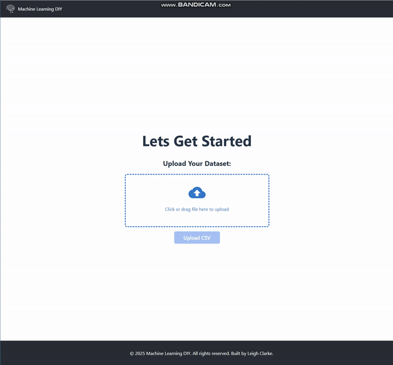

# ML Project - Machine Learning SaaS Template

This project is a full-stack web application template designed to simplify building Machine Learning Software as a Service (SaaS).

Users can upload their datasets, select a target variable for prediction, and let the backend handle preprocessing. Afterwards, users can choose from multiple machine learning models and adjust hyperparameters to fit their needs.

## Features

- Upload CSV datasets easily  
- Select the target column for prediction  
- Automatic backend preprocessing of data
- 
- Choose between different ML models  
- Hyperparameter tuning interface  

## Technology Stack

- **Frontend:** React, Axios  
- **Backend:** FastAPI (Python), CORSMiddleware  
- **Python Libraries:** pandas, scikit-learn, pydantic  
- **Authentication:** AWS Cognito  
- **Database:** AWS S3 (datasets, uploads)  

## Stage 1: - Completed ✅
- Complete setup of the stack.
- Ability to upload datasets (CSVs), which are saved locally and stored in a database (currently using a simple DB, planned upgrade later).
- Choose the predicted column.
- Display top 10 rows.
- Uploaded CSVs are also converted to Pandas DataFrames and saved as .pkl (pickle) files for reuse.
  

## Stage 2: - In Progress 42%
- Implement User login (AWS Cognito integration) coupled with member dashboard.
- Implement use of S3 DB.
- Implement Data Analysis of DataFrame and present to user.
- Implement backend data preprocessing (handle missing values, encoding categorical variables, normalization, etc.)
- Provide multiple regression and classification models (e.g., Linear Regression, Decision Trees, Random Forest, Logistic Regression)
- Allow users to select ML models and configure basic hyperparameters
- Run training and display evaluation metrics (e.g., accuracy, RMSE)

## Stage 3:
- Add advanced hyperparameter tuning options (grid search, random search)
- Enable saving and loading of trained models for reuse
- Implement user authentication and dataset/model management in the database
- Add support for dataset versioning and history
- Provide visualization of model results (e.g., confusion matrix, feature importance)
- Integrate asynchronous processing for long-running training jobs  
- Prepare for deployment (Docker setup, cloud hosting readiness)
